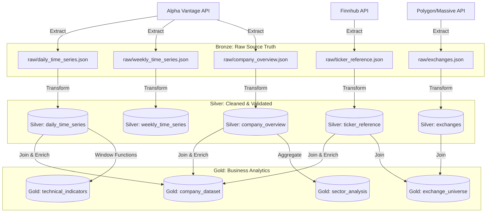

# End-to-End Data Flow Architecture

> **Repository**: `datalake-pipeline`
> **Architecture Pattern**: Medallion Data Lake (Bronze → Silver → Gold)
> **Processing Engine**: Apache Spark (PySpark)
> **Orchestration**: Custom Python `pipeline.py`

This document provides a high-level overview of how data moves through the entire pipeline, from raw external APIs down to the final analytical datasets in the Gold layer.

---

## 1. High-Level Medallion Data Flow

---

## 2. Phase 1: Ingestion (Bronze Layer)

**Goal**: Capture the exact state of the source system at the time of extraction. Do not alter data types, column names, or structures.

### Workflow:
1. **Trigger**: `pipeline.py` initiates extraction.
2. **API Handlers**:
   - `alpha_vantage_ingestion.py`: Handles `TIME_SERIES_DAILY`, `TIME_SERIES_WEEKLY`, and `OVERVIEW`. Manages multi-key rotation to avoid rate limits.
   - `finnhub_ingestion.py`: Handles ticker reference lists.
   - `massive_ingestion.py`: Handles Polygon.io exchange reference data.
3. **Storage Strategy**: Data is written as raw JSON payloads to S3.
4. **Partitioning**: `s3a://.../stock/bronze/source={api}/dataset={dataset}/year=YY/month=MM/day=DD/...`

---

## 3. Phase 2: Transformation (Silver Layer)

**Goal**: Create a reliable, high-quality, typed, and normalized data contract that the rest of the business can depend on.

### Workflow:
1. **Load Bronze Data**: PySpark reads the raw JSON payloads.
2. **Apply Silver Transformations** (in `src/stock_pipeline/transform/`):
   - **Schema Guards**: Verify expected columns exist.
   - **Type Casting**: Convert string prices to `DoubleType`, string dates to `DateType`.
   - **Text Normalization**: Trim whitespace, uppercase identifiers (e.g., symbols, MICs).
   - **Null Normalization**: Map placeholder strings (`"n/a"`, `"-"`) to true `NULL`.
   - **Data Quality**: Tag rows as `VALID` or `INVALID` based on business rules (e.g., `close > 0`). Generate comma-separated `validation_reason` strings.
   - **Deduplication**: Keep the latest record for each business key.
3. **Quarantine Routing** *(Roadmap)*: `INVALID` records are routed to an S3 quarantine path; `VALID` records proceed to Silver.
4. **Storage Strategy**: Data is written as Parquet and CSV files to S3.

---

## 4. Phase 3: Unification & Enrichment (Gold Layer)

**Goal**: Create denormalized, ready-to-query datasets tailored for specific business questions (dashboards, ML models, analyst reports).

### Workflow:
1. **Load Silver Datasets**: PySpark reads the clean Silver Parquet files.
2. **Apply Gold Transformations** (in `src/stock_pipeline/pipeline.py` & `gold/`):
   - **Joins**: Combine Time Series data with Company Overview fundamentals and Ticker Reference metadata (e.g., joining on `symbol`).
   - **Aggregations**: Compute sector-level metrics or moving averages (SMA/EMA).
   - **Lag Features**: Compute `previous_close` using window functions.
   - **Derivations**: Calculate daily percent changes, relative strength indices (RSI), etc.
3. **Storage Strategy**: Final unified datasets are written to the Gold S3 bucket as Parquet and CSV, ready to be consumed by Athena, Redshift, or Tableau.

---

## 5. Pipeline Orchestration & State Management

The entire flow is orchestrated by the `Pipeline` class in `src/stock_pipeline/pipeline.py`.

### Execution Sequence (`run_pipeline`):
1. **Initialize Execution Context**: Capture `execution_start_time` for partition tracking.
2. **Bronze Extraction**: Call APIs and write JSON to S3.
3. **Silver Validation**: Check data quality and schema.
4. **Silver Transformation**: Run the step-by-step PySpark transforms.
5. **Silver Load**: Write to Parquet/CSV in S3.
6. **Gold Build**: Join datasets and write unified output.

### Incremental Processing (Watermarking)
To avoid reprocessing historical data, the pipeline uses `WatermarkManager` (`src/stock_pipeline/watermark/manager.py`):
- **Date-Based**: For time-series (Daily/Weekly), the pipeline tracks the maximum `day_date` processed. Next run only fetches/processes `day_date > watermark`.
- **Hash-Based**: For snapshots (Company Overview), the pipeline computes a SHA-256 hash of the row. It only updates Silver if the hash changes.
